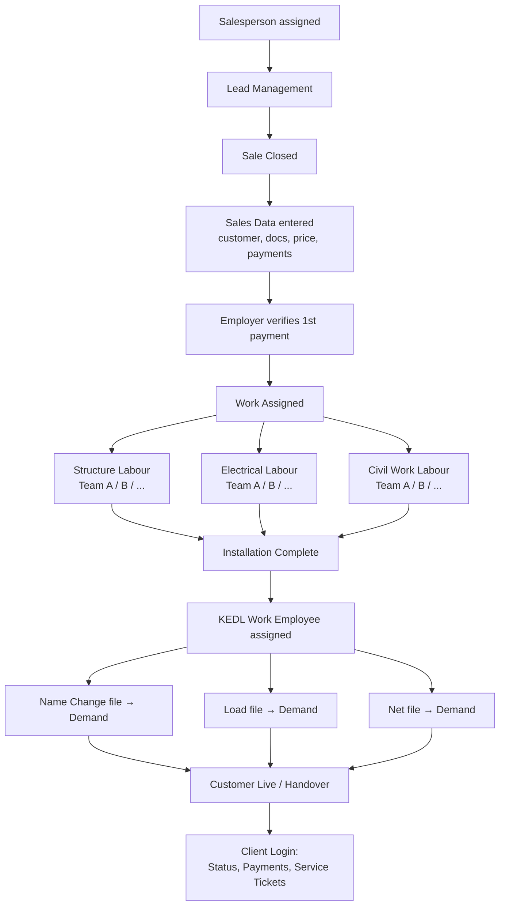
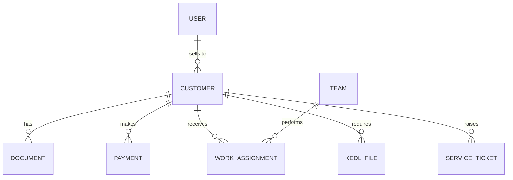

# 📱 Project Plan: Sales, Work & Service Management App

> **Platforms:** Android + iOS (Flutter)
> **Type:** Inventory / Project / Workforce management for an installation business
> **Status:** Planning, v0.1 (based on handwritten notes, pages 1-4)

---

## 📑 Table of Contents

1. [Project Overview](#-1-project-overview)
2. [User Roles](#-2-user-roles)
3. [End-to-End Workflow](#-3-end-to-end-workflow)
4. [Module Breakdown](#-4-module-breakdown)
5. [Data Models](#-5-data-models-draft)
6. [Screens List](#-6-screens-list)
7. [Tech Stack](#-7-suggested-tech-stack)
8. [Development Roadmap](#-8-development-roadmap)
9. [Open Questions](#-9-open-questions)

---

## 🎯 1. Project Overview

A single mobile app that connects **vendors (the business), their employees/labour teams, and customers** across the whole life of a job:

```
Lead  →  Sale Closed  →  Work Assigned  →  Installation  →  Govt/Discom Paperwork  →  Service & Support
```

**Core goals**

- Track every customer, document and payment in one place
- Assign work to the right labour team (Structure / Electrical / Civil)
- Track post-installation paperwork (KEDL demands: Name Change, Load, Net file)
- Give customers a login to see status, pay, and raise service tickets

> ⚠️ **Assumption:** The notes mention *Structure, Electrician, Inverter fault, Net file, Load file*, which strongly suggests a **solar rooftop installation business**, and **KEDL** looks like the local electricity distribution company. Please confirm.

---

## 👥 2. User Roles

| Role | Login | Main Purpose |
|------|-------|--------------|
| 🏢 **Vendor / Admin (Employer)** | Vendor Login | Owns the business, verifies payments, sees everything |
| 🧑‍💼 **Salesperson** | Vendor Login | Manages leads, closes sales, enters customer data |
| 👷 **Employee / Labour** | Vendor Login | Structure, Electrical, Civil teams doing the site work |
| 🗂️ **KEDL Work Employee** | Vendor Login | Handles discom paperwork after installation |
| 🙋 **Client / Customer** | Client Login | Tracks status, submits payment proof, raises service tickets |

---

## 🔄 3. End-to-End Workflow



---

## 🧩 4. Module Breakdown

### 🏢 Module A: Vendor Login

#### A1. Salesperson Assignment
- Admin assigns a salesperson to leads
- Two views for the salesperson:
  - **Lead Management** (open / follow-up leads)
  - **Sales Closed** (converted customers)

#### A2. Employee Management
- Add employees (**like labour**) with name, role, phone, team
- Assign them to a team (Team A, Team B, ...)

#### A3. Sales Data (customer record)

| Field | Notes |
|-------|-------|
| Customer Name | Required |
| Address | Plus **"Use current location"** (GPS) option |
| Mobile No. | Used for the customer login |
| Documents upload | E-Bill, Aadhaar, PAN, Cancelled Cheque, Registry (property paper) |
| Work final price | Agreed total amount |
| Payments | 1st payment, 2nd payment, ... **(many + options)** |

> 💡 **Payment rule:** all payments are **verified by the employer** before being marked as confirmed.

#### A4. Work Assignment
Once a sale is done, work is assigned *with the customer and dates*:

| Work Type | Teams |
|-----------|-------|
| 🏗️ **Structure Labour** | Team A, Team B, + many more options |
| ⚡ **Electrical Labour** | Team A, Team B, + many more options |
| 🧱 **Civil Work Labour** | Team A, Team B, + many more options |

#### A5. KEDL Work (Post-Installation Paperwork)
After the work is assigned/completed, a dedicated employee handles these files, each with a **Demand** (pending requirement/fee/request) tracked:

| File | Tracked Item |
|------|--------------|
| 📝 Name Change file | Demand |
| 📈 Load file | Demand |
| 🔌 Net file | Demand |

---

### 🙋 Module B: Client Login

| # | Feature | Details |
|---|---------|---------|
| 1 | **Project Status** | Shows status and the **assigned employee's number** |
| 2 | **Payment Submit** | Upload payment **with photo**; needs **approval by the salesman** |
| 3 | **Raise Service Ticket** | See types below |

**Service ticket types**

- 🏗️ **Structure issue**: upload **2 to 10 images**
- 🔌 **Wiring issue**: photo upload
- ⚙️ **Inverter fault**

---

## 🗄️ 5. Data Models (Draft)

```text
User            id, name, phone, role (admin|sales|labour|kedl|client), team_id?
Team            id, type (structure|electrical|civil), name (A, B, ...)
Lead            id, name, phone, source, status, assigned_sales_id
Customer        id, name, address, lat, lng, mobile, sales_id, final_price, status
Document        id, customer_id, type (ebill|aadhaar|pan|cheque|registry), file_url
Payment         id, customer_id, amount, stage (1st, 2nd...), photo_url,
                status (pending|approved|rejected), approved_by, date
WorkAssignment  id, customer_id, type, team_id, start_date, end_date, status
KedlFile        id, customer_id, type (name_change|load|net), demand, status
ServiceTicket   id, customer_id, type (structure|wiring|inverter),
                description, images[], status, assigned_to
```



---

## 🖼️ 6. Screens List

**Vendor side**
- Login / Role select
- Dashboard (leads, sales, pending payments, active works)
- Lead list & Lead detail
- Sales Closed list
- Add / Edit Customer (with GPS location + document upload)
- Payments (add, verify, history)
- Employee list & Add Employee
- Work Assignment (pick type → team → dates)
- KEDL Files tracker (Name Change / Load / Net + demand)

**Client side**
- Login (mobile + OTP)
- Status timeline
- Submit payment with photo
- Raise ticket (type, description, 2-10 images)
- My tickets

---

## 🛠️ 7. Suggested Tech Stack

| Layer | Suggestion | Why |
|-------|-----------|-----|
| App | **Flutter** (Dart) | One codebase for Android + iOS |
| State management | Riverpod or Bloc | Scales well for role-based apps |
| Backend | **Firebase** (Auth, Firestore, Storage) *or* Supabase | Fast to build; handles OTP, file upload |
| Auth | Phone OTP + role claims | Fits mobile-number-based users |
| Maps/Location | `geolocator` + Google Maps | "Current location" for address |
| Files/Images | `image_picker`, `file_picker` | Documents & ticket photos |
| Notifications | Firebase Cloud Messaging | Payment approvals, new assignments |

---

## 🗺️ 8. Development Roadmap

| Phase | Scope | Deliverable |
|-------|-------|-------------|
| **0. Setup** | Flutter project, Firebase, auth, role system | App skeleton with login |
| **1. Sales** | Leads, Sales Closed, customer record, documents, GPS | Salesperson can onboard customers |
| **2. Payments** | Multi-stage payments, photo proof, employer verification | Payment tracking |
| **3. Workforce** | Employees, teams, work assignment with dates | Work scheduling |
| **4. KEDL Tracker** | Name Change / Load / Net files + demands | Paperwork tracking |
| **5. Client App** | Status, payment submit, service tickets | Customer-facing features |
| **6. Polish** | Notifications, reports, offline handling, testing | Release candidate |

---

## ❓ 9. Open Questions

1. Is this a **solar installation** business? What does **KEDL** stand for?
2. Should **one app** serve all roles (role-based UI) or separate vendor/client apps?
3. What does **"Demand"** mean in the KEDL files: a fee, a document request, or a pending task?
4. What statuses should a project show the customer (e.g. Survey → Installed → Net Metering → Live)?
5. Who handles a **service ticket**: a specific employee or any team?
6. Do you need **inventory** (panels, inverters, cables, stock-in/out) tracking? You mentioned inventory management.
7. Languages: English only, or Hindi too?
8. Should there be reports/exports (Excel/PDF) for the employer?

---

*Send more material (notes, screenshots, flows) and I'll update this plan.*
