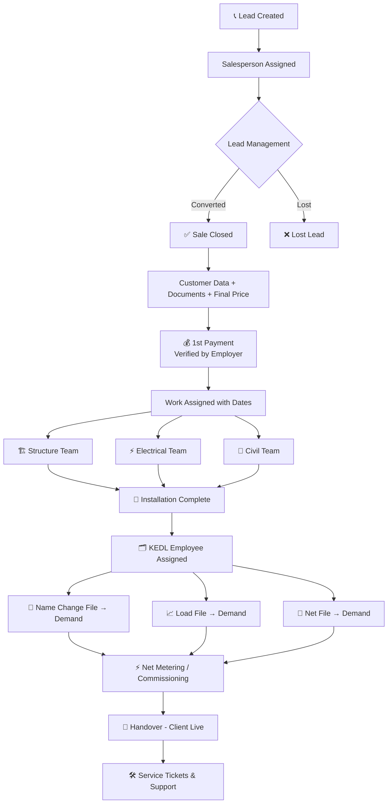
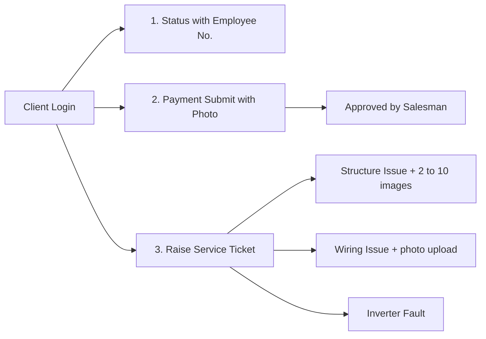
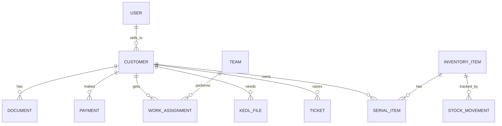

# ☀️ Solar Installation & Sales Management App

> **Platforms:** Android + iOS (Flutter)
> **Business:** Solar installation and selling
> **Version:** v0.2 (solar business confirmed, replaces the generic v0.1 plan)
> **Legend:** 📝 = from your notes | 💡 = my suggestion, please confirm or remove

---

## 📑 Table of Contents

1. [Project Vision](#-1-project-vision)
2. [Users & Roles](#-2-users--roles)
3. [Solar Project Lifecycle](#-3-solar-project-lifecycle)
4. [Modules in Detail](#-4-modules-in-detail)
5. [Inventory Management](#-5-inventory-management)
6. [Client App](#-6-client-app)
7. [Data Models](#-7-data-models-draft)
8. [Screens Map](#-8-screens-map)
9. [Tech Stack & Architecture](#-9-tech-stack--architecture)
10. [Roadmap](#-10-roadmap)
11. [Open Questions](#-11-open-questions)

---

## 🎯 1. Project Vision

One app to run the **entire solar business**, from the first lead to after-sales service:

```
Lead → Sale → Payment → Site Work → KEDL Paperwork → Net Metering → Live → Service
```

**What it solves**

| Problem | App Solution |
|---------|--------------|
| Leads and customer details scattered in notebooks/WhatsApp | Central lead + customer database |
| Documents (Aadhaar, PAN, E-Bill...) hard to find | Per-customer document vault |
| No clear view of who is doing which work | Team-wise work assignment with dates |
| Discom files (Name Change, Load, Net) get delayed | KEDL file tracker with demands |
| Payment disputes | Photo proof + employer verification |
| Customer keeps calling for status | Client login with live status |
| Complaints handled informally | Service tickets with photos |

---

## 👥 2. Users & Roles

| Role | App Access | Key Permissions |
|------|-----------|-----------------|
| 🏢 **Employer / Admin** | Vendor Login | Full access, **verifies payments**, assigns salespeople, sees reports |
| 🧑‍💼 **Salesperson** | Vendor Login | Leads, Sales Closed, adds customer data, approves client payment submissions 📝 |
| 👷 **Structure Labour** | Vendor Login | Sees assigned structure jobs |
| ⚡ **Electrical Labour** | Vendor Login | Sees assigned electrical jobs |
| 🧱 **Civil Labour** | Vendor Login | Sees assigned civil jobs |
| 🗂️ **KEDL Work Employee** | Vendor Login | Manages Name Change / Load / Net files 📝 |
| 🙋 **Client / Customer** | Client Login | Status, payments, service tickets |

> 💡 **One app, role-based screens.** After login, each user sees only their own menu.

---

## 🔄 3. Solar Project Lifecycle



### 📊 Suggested Status Stages (shown to client) 💡

| # | Stage | Triggered By |
|---|-------|--------------|
| 1 | Sale Confirmed | Salesperson |
| 2 | Documents Received | Salesperson |
| 3 | Advance Payment Verified | Employer |
| 4 | Structure Work | Structure team |
| 5 | Electrical Work | Electrical team |
| 6 | Civil Work | Civil team |
| 7 | Installation Complete | Admin |
| 8 | KEDL Process (Name / Load / Net) | KEDL employee |
| 9 | Net Meter Installed / System Live | KEDL employee |
| 10 | Handed Over | Admin |

---

## 🧩 4. Modules in Detail

### 🏢 A. Vendor Login 📝

#### A1. Salesperson Assignment
- Admin assigns a salesperson
- Two sections: **Lead Management** and **Sales Closed**
- 💡 Lead fields: name, phone, area, expected kW, source, follow-up date, notes, status

#### A2. Employee Management
- Add employees **like labour** (name, phone, role, team)
- 💡 Active/inactive toggle, ID proof upload

#### A3. Sales Data

| Field | Details |
|-------|---------|
| Customer Name | Required |
| Address | Manual entry **+ Current Location (GPS) button** |
| Mobile No. | Also used for client login |
| Documents | E-Bill, Aadhaar, PAN, Cancelled Cheque, Registry (property paper) |
| Work Final Price | Agreed total |
| Payments | 1st payment, 2nd payment... **(many + options)** |
| 💡 System Details | Capacity (kW), phase (single/three), panel brand & wattage, inverter brand, structure type |

> ✅ **Rule:** every payment is **verified by the employer**.

#### A4. Work Assignment 📝
Assign work **to customers with dates**:

| Work | Teams |
|------|-------|
| 🏗️ Structure Labour | Team A, Team B, + many options |
| ⚡ Electrical Labour | Team A, Team B, + many options |
| 🧱 Civil Work Labour | Team A, Team B, + many options |

💡 Add: scheduled date, start/end, status (Pending → In Progress → Done), site photos on completion, and a calendar view to avoid double-booking a team.

#### A5. KEDL Work 📝
Dedicated KEDL employee, **after work assign**:

| File | Tracks |
|------|--------|
| 📝 Name Change File | Demand |
| 📈 Load File | Demand |
| 🔌 Net File | Demand |

💡 For each file: status (Not Started → Submitted → Demand Raised → Demand Paid → Approved), demand amount, due date, receipts/documents upload, remarks.

---

## 📦 5. Inventory Management 💡

You mentioned inventory, so this is the module that keeps stock in check.

| Item Category | Examples |
|---------------|----------|
| Solar Panels | Brand, wattage, serial numbers |
| Inverters | Brand, kW, serial number, warranty |
| Structure Material | GI/MS structure, nuts, bolts |
| Electrical | DC/AC cables, ACDB, DCDB, MCB, earthing, lightning arrestor |
| Civil | Cement, foundation material |
| Net Meter | If supplied through you |

**Features**
- Stock in (purchase from supplier) and stock out (issued to a customer's project)
- Low-stock alerts
- **Serial number tracking** for panels and inverters, linked to the customer (needed for warranty and service tickets)
- Per-project material list vs. actual used
- Supplier list and purchase records

---

## 🙋 6. Client App 📝



| Feature | Details |
|---------|---------|
| **Status** | Current stage + the **assigned employee's number** to call |
| **Payment Submit** | Enter amount, upload proof photo, **approved by salesman** |
| **Service Ticket: Structure issue** | Description + **upload 2 to 10 images** |
| **Service Ticket: Wiring issue** | Description + photos upload |
| **Service Ticket: Inverter fault** | Description, 💡 optional photo/error code |
| 💡 Extras | Warranty info, system details, document download, ticket status tracking |

---

## 🗄️ 7. Data Models (Draft)

```text
User            id, name, phone, role, team_id?, active
Team            id, type (structure|electrical|civil), name
Lead            id, name, phone, area, expected_kw, status, assigned_sales_id, follow_up_date
Customer        id, name, mobile, address, lat, lng, sales_id, final_price,
                capacity_kw, phase, stage, created_at
Document        id, customer_id, type (ebill|aadhaar|pan|cheque|registry), file_url
Payment         id, customer_id, amount, stage_no, proof_url,
                status (pending|approved|rejected), submitted_by, approved_by, date
WorkAssignment  id, customer_id, work_type, team_id, start_date, end_date, status, photos[]
KedlFile        id, customer_id, type (name_change|load|net), status,
                demand_amount, demand_status, documents[], assigned_to
Ticket          id, customer_id, type (structure|wiring|inverter), description,
                images[], status, assigned_to, created_at, resolved_at
InventoryItem   id, category, name, brand, unit, stock_qty, min_stock
StockMovement   id, item_id, type (in|out), qty, customer_id?, date
SerialItem      id, item_id, serial_no, customer_id?, warranty_until
```



---

## 🖼️ 8. Screens Map

**🏢 Vendor side**
```
Dashboard
├── Leads → Lead Detail → Convert to Sale
├── Sales Closed → Customer Detail
│   ├── Info + Location
│   ├── Documents
│   ├── Payments
│   ├── Work Assignment
│   ├── KEDL Files
│   └── Material Used
├── Employees → Add / Edit
├── Work Schedule (Structure / Electrical / Civil, by team & date)
├── KEDL Tracker (Name Change / Load / Net)
├── Inventory (Items, Stock In/Out, Serials, Suppliers)
├── Payments to Verify
├── Service Tickets
└── Reports
```

**🙋 Client side**
```
Home (Status timeline + employee contact)
├── Submit Payment
├── Raise Ticket
├── My Tickets
└── My Documents / System Details
```

---

## 🛠️ 9. Tech Stack & Architecture

| Layer | Choice | Notes |
|-------|--------|-------|
| Framework | **Flutter** | Android + iOS |
| State Mgmt | Riverpod | Clean, testable |
| Backend | **Firebase** (Auth, Firestore, Storage, FCM) | Fastest start; Supabase is an alternative |
| Auth | Phone OTP + role-based access | Roles: admin, sales, labour, kedl, client |
| Location | `geolocator`, `google_maps_flutter` | Current-location button |
| Files | `image_picker`, `file_picker`, image compression | Many photo uploads, so compress them |
| Notifications | Firebase Cloud Messaging | Payment approvals, assignments, ticket updates |
| Export | PDF/Excel generation | Reports, payment receipts |
| Offline | Local cache for site workers | Poor network at rooftop sites |

**Folder structure (Flutter)**

```text
lib/
├── core/            # theme, routes, constants, utils
├── models/
├── services/        # firebase, storage, location
├── features/
│   ├── auth/
│   ├── leads/
│   ├── customers/
│   ├── payments/
│   ├── work_assign/
│   ├── kedl/
│   ├── inventory/
│   ├── tickets/
│   └── client/
└── main.dart
```

---

## 🗺️ 10. Roadmap

| Phase | Focus | Outcome |
|-------|-------|---------|
| **0** | Setup: Flutter, Firebase, OTP login, roles | Working login for all roles |
| **1** | Leads + Sales Closed + Customer data + documents + GPS | Sales team can use it |
| **2** | Payments with photo proof + verification | Money tracking |
| **3** | Employees, teams, work assignment with dates | Site scheduling |
| **4** | KEDL tracker (Name / Load / Net + demands) | Paperwork control |
| **5** | Client app: status, payment submit, tickets | Customer-facing launch |
| **6** | Inventory with serial tracking | Stock control |
| **7** | Notifications, reports, polish, testing | Production release |

> 💡 **Tip:** Launch Phases 0 to 3 as an internal MVP first, then add the rest.

---

## ❓ 11. Open Questions

1. What does **KEDL** stand for exactly, and what does a **"Demand"** mean there (fee, document request, or pending task)?
2. Do you sell under a **subsidy scheme** (like PM Surya Ghar)? If yes, subsidy tracking needs its own stage.
3. Do you also need **site survey** and **design/quotation** steps before the sale closes?
4. Should the client **pay online** (UPI/gateway) or only upload proof photos as in your notes?
5. Who **handles service tickets**: a specific employee or any team?
6. Do you want **commission tracking** for salespeople?
7. Languages: English only, or Hindi too?
8. Roughly how many users (employees and customers) at start?

---

*Share more notes or flows, and I'll update this document to v0.3.*
