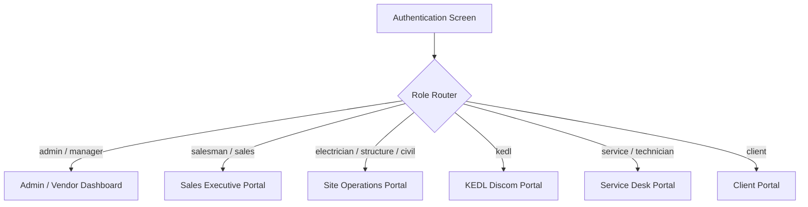

# SolarPro Employee Portal Architecture & Developer Guide

This document describes the design, implementation, folder structure, features per role, and build instructions for the **SolarPro Employee Portal** within the unified Flutter application.

---

## 1. Architecture & Portals Overview

The SolarPro mobile application hosts three distinct operational portals inside a single unified codebase:
1. **Admin / Vendor Dashboard** (`/vendor/...`): Full management of inventory, all leads, staff accounts, discom filings, and executive approvals.
2. **Employee Portal** (`/employee/...`): Role-tailored operational shell with strict view isolation for field and office staff.
3. **Client Portal** (`/client/...`): Real-time installation tracking, milestone payment submissions, generation monitoring, and service ticket requests for homeowners and commercial clients.



### Role Routing Matrix
The role routing matrix is implemented in `lib/core/router/app_router.dart` and `lib/core/constants/app_constants.dart`. Each user role resolves directly to their designated portal, and access guards ensure users cannot access other roles' routes.

---

## 2. Features per Role

### A. Sales Executive (`salesman` / `sales`)
- **Leads Tab**:
  - Filter chips: All, Follow-up Today, Overdue, Closed, Returned.
  - Quick action: "Add Lead" bottom sheet with duplicate detection.
  - Detail screen: Direct call, WhatsApp integration, scheduled follow-up reminders.
- **Convert Lead (7-Step Wizard)**:
  - Step 1: Customer Profile (Name, Phone, Email, Site Address).
  - Step 2: System Specifications (kW capacity, Phase, Sanctioned Load).
  - Step 3: Subsidy & Panels (DCR subsidy vs. NDCR non-subsidy toggle).
  - Step 4: Inverter & Structure (Brands, models, structure height, tilt angle).
  - Step 5: Wiring, Protection & Earthing (AC/DC wire gauge, ACDB/DCDB SPD ratings, earthing pits).
  - Step 6: Document Attachments (Aadhar KYC, Electricity Bill, Rooftop Layout).
  - Step 7: Pricing & Review (Total price, Subsidy, Advance amount — **strictly calculated in integer paise**).
  - **Draft Management**: Auto-saved to local device storage; resume conversion anytime.
- **Bespoke Payment Plan Builder**:
  - Custom milestones (Advance, Structure Dispatch, Inverter Dispatch, Net Metering, Handover).
  - Validation: Percentages must equal 100% or amount must match total client payable.
  - Plan Lock: Automatically locks once the first payment is approved by Sales.
  - Loan Support: Bank name, sanctioned loan amount, loan installment schedules.
- **Sales Approval Queue**:
  - Reviews client payment submissions; approving transitions payment to *"Waiting for Admin Verification"*.

---

### B. Site Teams (`electrician`, `structure`, `civil`)
- **Strict Role Scoping**:
  - Electricians see only electrical wiring and inverter installation assignments.
  - Structure teams see only mounting and mechanical structure jobs.
  - Civil teams see only civil foundations and earthing pit assignments.
- **Technical Scope Isolation**:
  - Site workers see `CustomerShortForLabourModel` (Customer Name, Phone, and Site Address).
  - **Zero financial exposure**: Prices, subsidy figures, loan details, and customer KYC documents are never exposed to site workers.
- **Mandatory Photo Proofs**:
  - Starting work marks status `in_progress` and records `actual_start`.
  - Completing work **strictly requires at least 1 verified photo proof** (up to 10 photos); blocked by the application and API if photos are missing.
- **Offline Action Queue**:
  - Start job, capture photo proofs, and complete job actions queue persistently if the field device is offline.
  - Auto-syncs as soon as internet connectivity is restored.

---

### C. KEDL Discom Employee (`kedl`)
- **Discom Files Management**:
  - Tracks three required files per customer:
    1. **Name Change** (`name_change`)
    2. **Load Increase** (backend value `load`, displayed in UI as *"Load Increase"*)
    3. **Net Metering** (`net`)
  - Status progression: `Not Started` $\rightarrow$ `Submitted` $\rightarrow$ `Demand Raised` $\rightarrow$ `Demand Paid` $\rightarrow$ `Approved` (or `Rejected`).
- **Demand Handling**:
  - Demands stored with amounts in **integer paise**.
  - Overdue calculations: Highlights overdue demands in red with remaining or overdue days.
  - Raising a demand automatically sets file status to `demand_raised`.
  - Paying all demands automatically updates file status to `demand_paid`.
- **System Handover**:
  - Approving the Net Metering file automatically transitions the customer to `SYSTEM_LIVE`.

---

### D. Service Desk Employee (`service` / `technician`)
- **Assigned Tickets Queue**:
  - Filter by status (`Assigned`, `In Progress`, `Resolved`) and priority (`Urgent`, `High`, `Normal`, `Low`).
  - Filter by ticket type: `Structure Issue` (2-10 photos), `Wiring Issue` (1-10 photos), `Inverter Fault` (0-10 photos, optional error code).
  - Technicians see only tickets assigned to them.
- **Ticket Detail**:
  - Customer contact info with direct call and directions.
  - Image gallery with full-screen zoom inspection.
  - Interactive technician-customer comment thread.
  - **Mandatory Resolution Note**: Resolving a ticket strictly requires a detailed resolution note.
- **Reverse Equipment Serial Lookup**:
  - Enter or scan serial barcode (e.g. `INV-GW-5K-9901`).
  - Resolves equipment model, manufacturer, installation date, customer contact, and warranty expiration.
  - Displays green "ACTIVE WARRANTY" or red "WARRANTY EXPIRED" banner.

---

### E. Common Platform Features
- **Notifications & Role Deep-Linking**:
  - In-app notification center (`GET /notifications`, unread counts, mark read, mark all read).
  - FCM token registration (`POST /auth/fcm-token`).
  - **Strict role deep-linking**: Notification taps land safely inside the user's allowed portal (leads $\rightarrow$ Salesman, jobs $\rightarrow$ Site, tickets $\rightarrow$ Service Desk) and never cross portal boundaries.
- **Unified Upload Service & Pending Sync Screen**:
  - Shared upload service (`SharedUploadService`) with progress percentage tracking, retry, and cancellation.
  - `PendingSyncScreen`: Displays pending uploads and offline actions, surviving app restarts.
- **Centralized Error Handling**:
  - `AppErrorHandler`: Maps backend error envelopes `{"error": {"code", "message", "details"}}` into user-friendly localized messages.
- **Permissions Helper**:
  - `PermissionHelper`: Educational explanation dialogs prior to requesting camera, gallery, location, and notification access.
- **Profile Screen**:
  - User name, role badge, phone number, designated Team/Division, pending sync count, permissions manager, and secure logout.

---

## 3. Folder Structure

```text
lib/
├── core/
│   ├── constants/
│   │   └── app_constants.dart          # AppRoutes, storage keys, API URLs
│   ├── network/
│   │   ├── api_client.dart             # Dio HTTP client, JWT interceptor, token refresh
│   │   └── app_error_handler.dart      # Error mapper for backend error envelopes
│   ├── router/
│   │   └── app_router.dart             # GoRouter configuration & role guards
│   ├── services/
│   │   └── shared_upload_service.dart  # Background upload queue with persistence
│   ├── theme/
│   │   └── app_theme.dart              # SolarPro color palette & typography
│   └── utils/
│       ├── money_formatter.dart        # Integer paise to INR currency formatter
│       └── permission_helper.dart      # Camera, storage, GPS permission dialogs
├── features/
│   ├── auth/                           # Login UI (Preserved, never modified)
│   ├── customer/                       # CustomerModel (all money in integer paise)
│   ├── employee/
│   │   ├── common/
│   │   │   ├── employee_shell.dart     # Role-based shell navigation & profile tab
│   │   │   └── pending_sync_screen.dart# Offline queue & upload manager screen
│   │   ├── kedl/                       # KEDL files, demands, and file detail
│   │   ├── salesman/                   # Leads, draft manager, 7-step wizard, payment plan
│   │   ├── service/                    # Tickets queue, resolution notes, serial lookup
│   │   └── site_work/                  # Electrical, structure, civil jobs & photo proof
│   ├── notifications/                  # NotificationsScreen, NotificationRepository
│   ├── tickets/                        # Ticket models and repository
│   └── work_assignment/                # Work assignment models, offline queue service
└── shared/
    └── widgets/
        └── sp_bottom_nav.dart          # Responsive bottom navigation bar
```

---

## 4. Financial Precision & Integer Paise Rule

In adherence to strict financial standards:
- **No floating-point money values**: All currency fields (`totalPricePaise`, `subsidyPaise`, `advancePaise`, `amountPaise`) are stored as **integer paise** ($1\text{ Rupee} = 100\text{ Paise}$).
- `MoneyFormatter.formatPaiseToInr(int paise)` formats figures with Indian number groupings (e.g. `₹2,50,000`).

---

## 5. Running & Building the App

### Running in Development:
```powershell
flutter pub get
flutter run
```

### Running Test Suites:
```powershell
flutter test
```

### Running Architecture & Compatibility Checker:
```powershell
dart run tools/check_compat.dart
```

### Production Release Build:
Refer to [docs/RELEASE.md](file:///d:/Internship/Solar%20Android%20App/SolarPro/docs/RELEASE.md) for full keystore configuration, Proguard rules, and APK/AAB build commands:
```powershell
flutter build apk --release
```

---

## 6. Known Gaps & Backend Alignment

Refer to [docs/BACKEND_GAPS.md](file:///d:/Internship/Solar%20Android%20App/SolarPro/docs/BACKEND_GAPS.md) for detailed analysis of features supported via repository abstractions pending future backend migrations (e.g. dedicated loan tables and fine-grained equipment columns).
